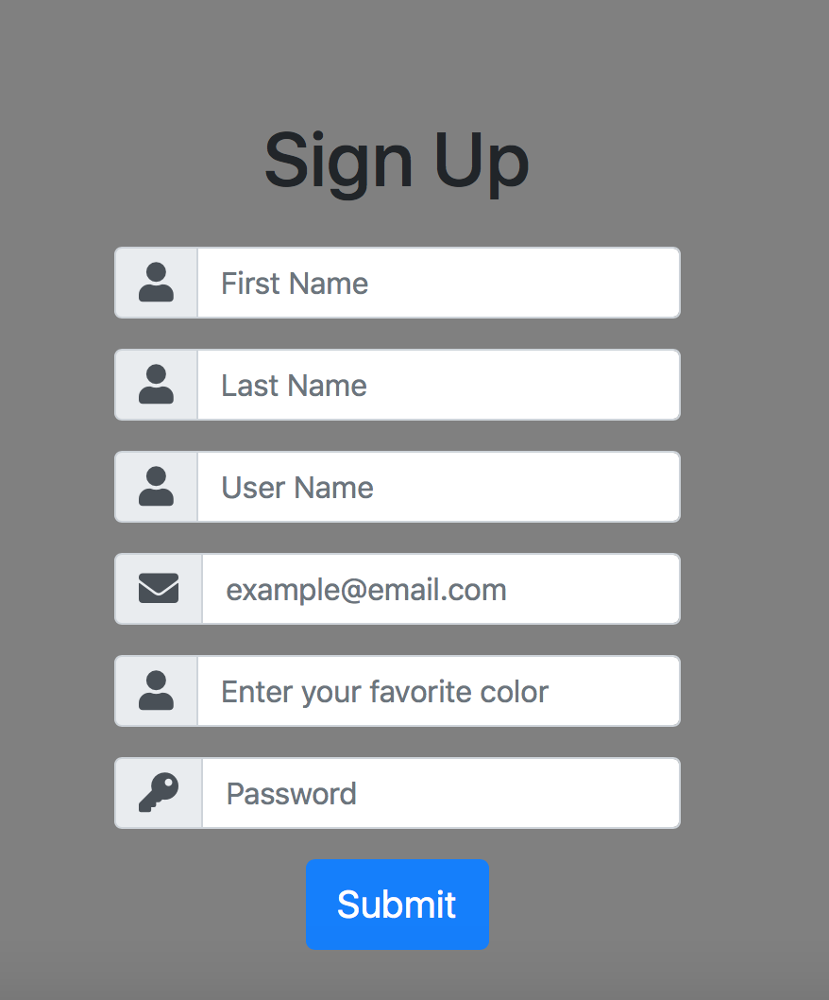
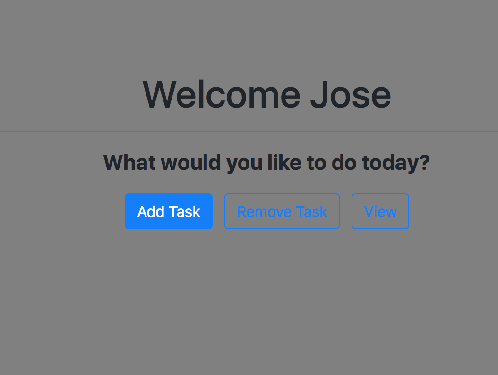

App tutorial
==============
If you are a new user click on the register bottom on the upper right corner.

.. image:: img/upperight.png
  :width: 400
  :alt: Alternative text

Once clicked this sign in form should show up in your screen and complete it following
the questions such as fist name, last name, user name, email, favorite color and
password.

When you finish registering to the page. Click on the upper right corner where it says
Go Home and sign in with your username and password.

If password is forgotten. That's no, just click on the upper right corner after trying
to sign in where it says Forgot Password where a your user name and  security question
of your favorite color would be needed in order to reset it.

.. image:: img/forgot.tiff
  :width: 400
  :alt: Alternative text
If you gracefully sign in then the following landing page would be display

.. image:: img/landing.tiff
  :width: 400
  :alt: Alternative text

Where this three features would be shown:

1) Add Task

2) Remove Task

.. image:: img/remove.tiff
  :width: 400
  :alt: Alternative text

3) View Task

.. image:: img/view.tiff
  :width: 400
  :alt: Alternative text

On the Add Task a user can add a task with a description as following and then save it.

.. image:: img/groceries.tiff
  :width: 400
  :alt: Alternative text

Once the task is saved user can view the task by going to the Home Page (Right upper corner)
and clicking on view task where the recent added task is displayed.

.. image:: img/vieworg.tiff
  :width: 400
  :alt: Alternative text

Also, the organize function of our app let you organize your task alphabetically. For example:

.. image:: img/organize.tiff
  :width: 400
  :alt: Alternative text

To remove the task go to the Home Page (upper right corner) where the remove option is and type
the task you want to remove as following and click remove.

.. image:: img/artclass.tiff
  :width: 400
  :alt: Alternative text

Once its clicked the task will be removed.

.. image:: img/noartclass.tiff
  :width: 400
  :alt: Alternative text

Also, there is the option to remove all the task at once by clicking on the red bottom saying
Yes to remove all the tasks.

.. image:: img/removeall.tiff
  :width: 400
  :alt: Alternative text

Once you are done using the task organizer click on the right left bottom that says Log Out for
your session to be terminated. You can logout and your task won't be remove.

.. image:: img/done.tiff
  :width: 400
  :alt: Alternative text
